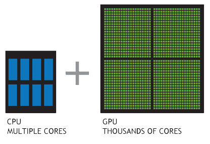
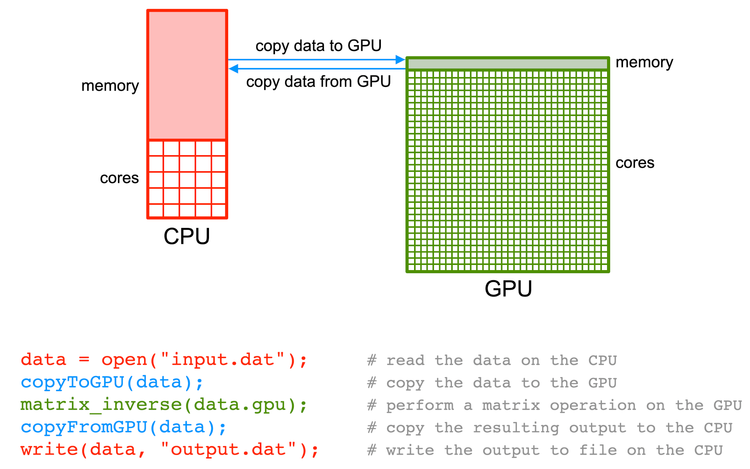

# Getting started with GPGPU programming in Rust

August 2024

---

# Caveat...

The General Purpose GPU computing space has lots of different:

- __Vendors__ - NVIDIA, AMD, Intel, etc.
* __GPU architectures__ - even within vendors
* __GPGPU APIs__ - CUDA, OpenGL, Vulkan, WebGPU, etc.
* __Abstractions of GPGPU APIs__
* __Abstractions of abstractions of GPGPU APIs__
* __Methods of writing and compiling GPGPU projects__

_We can't get into all of this. Feelings of disappointment may occur._

---

# Another caveat...

- I'm new to the GPGPU computing space
- Presenting a beginner's view for beginners

---

# Outline

- General Purpose GPU computing overview
- Context around CPUs and GPUs
- Memory safety
- GPGPU programming mechanics
- GPU crates/projects
- General observations
- Where to learn more

---

# GPGPU overview

* Good for [embarrassingly parallel](https://www.cs.iusb.edu/~danav/teach/b424/b424_23_embpar.html) problems:
    - easy to divide
    - no communication between tasks
    - no results dependencies between tasks
* Many types of problems can be encoded as "graphics" problems (APIs like CUDA help with this)
* Applications: Wide range of simulation, linear algebra, FFT, audio processing, machine learning, crypto, etc.
* __WHY?__ Performance (and feeling cool)

---

# CPU vs. GPU

For context:



_Rust is designed for CPUs_

---

# Simple kernel example

```rust
#[kernel]
pub unsafe fn add(a: &[f32], b: &[f32], c: *mut f32) {
    let idx = thread::index_1d() as usize;
    if idx < a.len() {
        let elem = &mut *c.add(idx);
        *elem = a[idx] + b[idx];
    }
}
```

source: [GPU Computing with Rust using CUDA](https://rust-gpu.github.io/Rust-CUDA/guide/getting_started.html#writing-our-first-gpu-kernel)

```
A = [0, 1, 2, 3, 4]    B = [2, 3, 4, 5, 6]
```

---

# CPU/GPGPU interaction

 [source](https://researchcomputing.princeton.edu/support/knowledge-base/gpu-computing)

---

# Memory safety

* GPUs are co-processors - operate asynchronously
* CPU memory safety models don't translate to GPUs
* Rust's memory safety model is specific to CPUs
* You can't write "memory safe" Rust for GPUs (_womp, womp_)
* Memory in GPUs is complex and its own topic

---

# How GPGPU programming works

- Project generates two separate programs: one for CPU and one for GPU
- CPU and GPU programs run through separate compiler chains
- CPU and GPU programs execute separately at the same time - interface is async

---

# Crates for GPU programming in Rust

1. [wgpu](https://wgpu.rs/) - "cross-platform, safe, pure-rust graphics API. It runs natively on Vulkan, Metal, D3D12, and OpenGL; and on top of WebGL2 and WebGPU on wasm."
2. [Rust-CUDA](https://github.com/Rust-GPU/Rust-CUDA) - collection of crates for working in the CUDA ecosystem; can provide a lot of control
3. [vulkano](https://github.com/vulkano-rs/vulkano) - Rust wrapper around Vulkan graphics API

__Caution__: there are a lot of WIP and abandoned crates since the space is evolving. The ones above are still unstable.

---

# Observations

* A lot of documentation is aimed at folks from going GPU programming in C++ to GPU programming in Rust
  * Not a lot aimed at people going from Rust to GPU programming in Rust (maybe due to ecosystem immaturity?)
* Application-specific learning curves (for hardware, API, library, etc.)

---

# Resources for learning more

- [`wgpu` tutorial](https://sotrh.github.io/learn-wgpu/) - one of the few good tutorials on Rust + GPU
- [FAQs of GPU Computing with Rust using CUDA](https://rust-gpu.github.io/Rust-CUDA/faq.html) - detailed explanation of Rust and CUDA interaction, including limitations of Rust for GPU programming
- [Rust GPU](https://rust-gpu.github.io/) - ambitious attempt to make Rust a first-class language for GPU programming
- Reddit threads like [this one](https://www.reddit.com/r/rust/comments/18209in/gpu_programming_in_rust/), but be careful because not everything said is accurate
